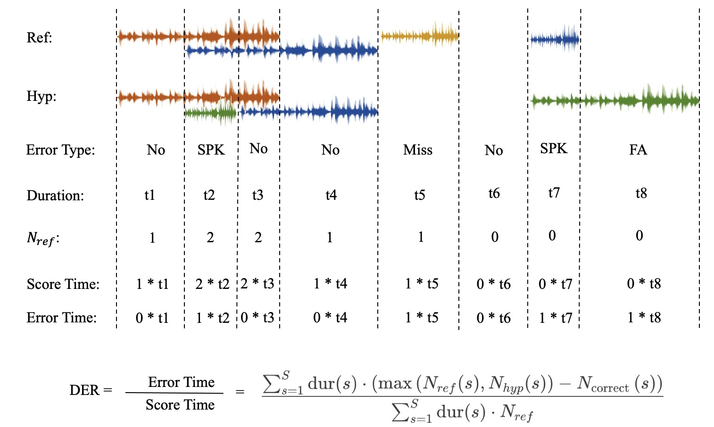
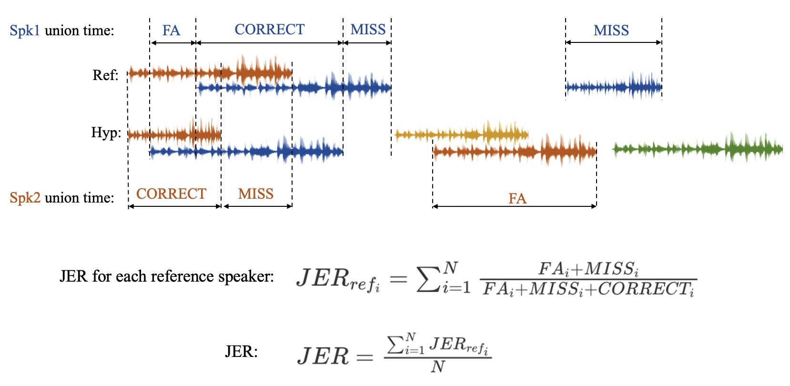

# Evaluation Metric

## Diarization error rate

The detail defination of diarization error rate can be found in [here](http://www.xavieranguera.com/phdthesis/node108.html).

#### Three different error

- False alarm (FA) speech: a hypothesized speaker is labelled as a non-speech in the reference
- Missed speech (Miss): a hypothesized non-speech segment corresponds to a reference speaker segment
- Speaker erri (SPK): a speaker ID is assigned to the wrong speaker 

#### Calculation Step

1. Does an optimum one-to-one mapping of all speaker label ID between hypothesis and reference files.
2. Chunk the reference and hypothesis to segments that there is **no speaker change** in each segment.
3. Calculate the score time (see below).
4. Calculate the error time (see below).
5. Calculate DER for each meeting excerpt.
6. Once the performance is obtained for each individual meeting excerpt, the time weighted average is done among all meetings in a given set to obtain an overall average score. 

## Jaccard error rate

A metric introduced for [DIHARD II](https://coml.lscp.ens.fr/dihard/index.html) that is based on the [Jaccard index](https://en.wikipedia.org/wiki/Jaccard_index). The Jaccard index is a similarity measure typically used to evaluate the output of image segmentation systems and is defined as the ratio between the **intersection** and **union** of two segmentations.

#### Calculation Step

1.  An optimal mapping between speakers is determined using the Hungarian algorithm.
2. Calculate the JER for each **reference speaker**
   1. Calculate the **union time** that the specific speaker occured in reference and hypothesis.
   2. Calculate the time in union apart from the intersection part (FA and MISS).
   3. Calculate the JER for this reference speaker.
3. Average the JER of each reference speaker.

JER and DER are highly correlated with JER typically being higher, especially in recordings where one or more speakers is particularly dominant. Where it tends to track DER is in outliers where the diarization is especially bad, resulting in one or more unmapped system speakers whose speech is not then penalized. In these cases, where DER can easily exceed 500%, JER will never exceed 100% and may be far lower if the reference speakers are handled correctly. For this reason, it may be useful to pair JER with another metric evaluating speech detection and/or speaker overlap detection.
